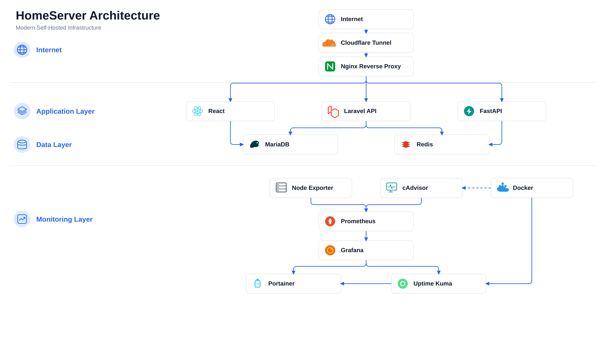

<p align="center">
  
</p>

<p align="center">
  
</p>

<h1 align="center">🏠 HomeServer</h1>

<p align="center">
  <strong>Learn • Build • Deploy • Monitor</strong>
</p>

<p align="center">
  An open-source blueprint for building your own modern self-hosted server using Docker, Cloudflare Tunnel and production-ready DevOps practices.
</p>

<p align="center">


</p>

---

# 🚀 What is HomeServer?

HomeServer is an open-source project that documents the complete journey of building a modern self-hosted server from scratch.

Rather than providing only source code, this repository explains every decision, configuration and deployment step required to create a reliable development server running on your own hardware.

By following the documentation, you will learn how to build an infrastructure that includes:

- 🌐 Nginx Reverse Proxy
- ⚛️ React Frontend
- 🚀 Laravel Backend
- 🤖 FastAPI AI Service
- 🗄️ MariaDB
- ⚡ Redis
- 📊 Prometheus
- 📈 Grafana
- ❤️ Uptime Kuma
- 🐳 Portainer
- ☁️ Cloudflare Tunnel

Whether you are learning self-hosting, building a personal lab, creating a development environment, or hosting your own applications, HomeServer provides a practical roadmap based on a real project built step by step—not just a collection of configuration files.

---

# 🎯 Project Goals

- Build a complete self-hosted development server.
- Learn modern DevOps technologies through real implementation.
- Deploy applications using Docker Compose.
- Secure services without opening router ports.
- Monitor the entire infrastructure.
- Document every step to make the project easy to reproduce.

---

# ⚡ Quick Start

> **Already have Ubuntu Server, Docker and Git installed?**
>
> You can start HomeServer in just a few minutes.

```bash
git clone https://github.com/AmrHassanKhalaf/HomeServer.git

cd HomeServer

cp compose/.env.example compose/.env

nano compose/.env

docker compose up -d
```

After the containers start, open your browser:

```
http://SERVER_IP
```

Your HomeServer is now running.

If this is your first self-hosted server, follow the complete **Getting Started** guide before continuing.
---

# 📚 Documentation

The documentation is designed for two types of users:

### 👨‍💻 I want to build my own Home Server

Follow the **Getting Started** guides from beginning to end.

```
docs/
└── getting-started/
```

---

### 🛠 I want to understand how everything works

Read the technical guides.

```
docs/
├── guides/
└── reference/
```

---

### 📖 Documentation Structure

| Section | Description |
|---------|-------------|
| Getting Started | Build HomeServer from scratch |
| Guides | Learn every service in detail |
| Reference | Architecture and configuration |
| Troubleshooting | Solve common problems |

---

# ✨ Features

- 🐳 Docker Compose infrastructure
- 🌐 Nginx Reverse Proxy
- ☁️ Cloudflare Tunnel integration
- ⚛️ React production frontend
- 🚀 Laravel API
- 🤖 FastAPI AI services
- 🗄️ MariaDB database
- ⚡ Redis caching
- 📊 Grafana dashboards
- 📈 Prometheus metrics
- ❤️ Uptime Kuma monitoring
- 🐳 Portainer management
- 💾 Automated backup scripts
- 🔒 Secure remote development
- 📚 Complete step-by-step documentation
- 🚀 Production-ready project structure

# 🏗️ Architecture

<p align="center">
  <picture>
    <source media="(prefers-color-scheme: dark)" srcset="assets/diagrams/architecture-dark.png">
    
  </picture>
</p>

HomeServer follows a layered architecture that separates networking, applications, data storage, monitoring and management into independent components.

| Layer | Components | Purpose |
|--------|------------|---------|
| 🌍 Internet | Internet, Cloudflare Tunnel | Secure public access without opening router ports. |
| 🌐 Reverse Proxy | Nginx | Routes incoming requests to the correct application. |
| 🚀 Application | React, Laravel, FastAPI | Hosts the frontend, backend API and AI services. |
| 💾 Data | MariaDB, Redis | Persistent storage and caching. |
| 📊 Monitoring | Prometheus, Grafana, Node Exporter, cAdvisor | Collects infrastructure and container metrics. |
| 🛠️ Management | Portainer, Uptime Kuma | Container management and service health monitoring. |

The diagram above represents the production architecture used by the current HomeServer release.

---

# 📦 Repository Structure

```text
HomeServer/
│
├── apps/                  # Applications
├── assets/                # Logos, banners and diagrams
├── compose/               # Docker Compose configuration
├── docker/                # Docker and Nginx configuration
├── docs/                  # Project documentation
├── monitoring/            # Prometheus configuration
├── scripts/               # Automation and backup scripts
│
├── README.md
├── LICENSE
├── CHANGELOG.md
├── ROADMAP.md
├── SECURITY.md
└── CONTRIBUTING.md

---

# 🐳 Included Services

| Service | Role |
|---------|------|
| Nginx | Reverse Proxy |
| React | Frontend Application |
| Laravel | Backend API |
| FastAPI | AI Services |
| MariaDB | Relational Database |
| Redis | Cache & Queue |
| Prometheus | Metrics Collection |
| Grafana | Monitoring Dashboards |
| Node Exporter | Host Metrics |
| cAdvisor | Container Metrics |
| Uptime Kuma | Health Monitoring |
| Portainer | Docker Management |
| Cloudflare Tunnel | Secure Remote Access |
---

# 🗺️ Roadmap

## ✅ Version 1.0

- Docker Compose infrastructure
- Nginx reverse proxy
- Laravel + React + FastAPI stack
- MariaDB & Redis
- Monitoring with Prometheus and Grafana
- Uptime Kuma integration
- Cloudflare Tunnel
- Backup scripts
- Complete documentation

## 🚀 Planned

- HomeServer CLI
- One-command installer
- Automatic SSL management
- Multi-environment support
- CI/CD pipeline
---

# 🤝 Contributing

Contributions are welcome.

If you would like to improve HomeServer, please read the **CONTRIBUTING.md** guide before opening an Issue or Pull Request.

---

# 📄 License

HomeServer is released under the MIT License.

See the **LICENSE** file for more information.
