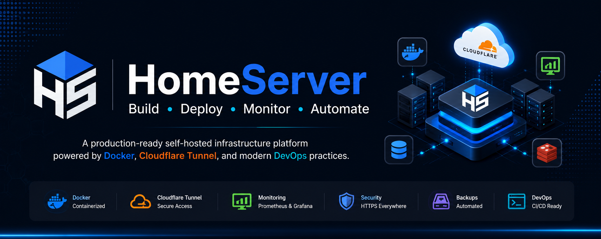

<p align="center">
  
</p>

<p align="center">
  
</p>

<h1 align="center">🏠 HomeServer</h1>

<p align="center">
<b>Build • Deploy • Monitor • Automate</b>
</p>

<p align="center">
Production-ready self-hosted infrastructure platform powered by Docker, Cloudflare Tunnel and modern DevOps practices.
</p>

<p align="center">


</p>

---

# 🚀 HomeServer

HomeServer is a production-ready self-hosted infrastructure platform that allows developers to deploy, manage and monitor modern applications from a single Ubuntu server.

The project combines modern DevOps tools into one unified platform including Docker, Cloudflare Tunnel, Nginx, Laravel, React, FastAPI, Prometheus, Grafana, Portainer and automated backup scripts.

The primary goal of HomeServer is to provide a secure, scalable and developer-friendly self-hosted environment without exposing your home network through port forwarding.

---

# ✨ Features

- 🐳 Docker Compose Infrastructure
- ☁️ Cloudflare Tunnel Integration
- 🌐 Nginx Reverse Proxy
- ⚛ React Frontend
- 🚀 Laravel Backend
- 🤖 FastAPI AI Service
- 🗄 MariaDB Database
- ⚡ Redis Cache
- 📊 Grafana Dashboards
- 📈 Prometheus Monitoring
- ❤️ Uptime Kuma Monitoring
- 📦 Portainer Management
- 💾 Automated Backup Scripts
- 🔒 Secure Remote Development
- 💻 VS Code Remote SSH
- 📁 Organized Infrastructure Repository

---

# 🏗 Architecture

```text
                        Internet
                            │
                            ▼
                     Cloudflare DNS
                            │
                            ▼
                   Cloudflare Tunnel
                            │
                            ▼
                     Ubuntu HomeServer
                            │
                    Docker Compose Stack
                            │
      ┌─────────────────────┼─────────────────────┐
      ▼                     ▼                     ▼
   React                 Laravel              FastAPI
      │                     │                     │
      └──────────────┬──────┴─────────────────────┘
                     ▼
             MariaDB + Redis

────────────────────────────────────────────────────────

Monitoring Stack

Node Exporter
      │
      ▼
Prometheus
      │
      ▼
Grafana

────────────────────────────────────────────────────────

Infrastructure

Nginx

Cloudflare Tunnel

Portainer

Uptime Kuma

Backup Scripts
```

---

# 📦 Included Services

| Service | Purpose |
|----------|---------|
| React | Frontend |
| Laravel | Backend API |
| FastAPI | AI Services |
| MariaDB | Database |
| Redis | Cache |
| Nginx | Reverse Proxy |
| Prometheus | Metrics |
| Grafana | Dashboards |
| Uptime Kuma | Health Monitoring |
| Portainer | Docker Management |
| Cloudflare Tunnel | Secure Public Access |

---

# 📂 Repository Structure

```text
HomeServer
│
├── apps/
├── assets/
├── backups/
├── compose/
├── configs/
├── docker/
├── docs/
├── infrastructure/
├── monitoring/
├── scripts/
├── README.md
├── LICENSE
└── ROADMAP.md
```
